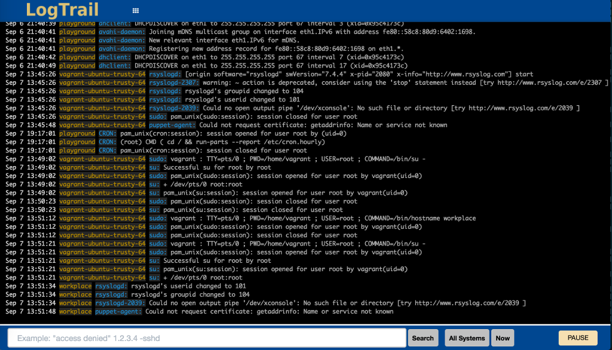

# LogTrail - Log Viewer plugin for Kibana

[](https://travis-ci.org/sivasamyk/logtrail) [](https://github.com/sivasamyk/logtrail/releases) [](https://www.elastic.co/downloads/past-releases/kibana-6.1.3)
[](https://github.com/sivasamyk/logtrail) [](https://paypal.me/sivasamyk)

LogTrail is a plugin for Kibana to view, analyze, search and tail log events from multiple hosts in realtime with devops friendly interface inspired by [Papertrail](https://papertrailapp.com/).



Features
--------
 - View, analyze and search log events from a centralized interface
 - Clean & simple devops friendly interface
 - Live tail
 - Filter aggregated logs by hosts and program
 - Quickly seek to logs based on time
 - Supports highlighting of search matches
 - Supports multiple Elasticsearch index patterns each with different schemas
 - Can be extended by adding additional fields to log event
 - Color coding of messages based on field values

Installation
------------
- Prerequisites
  - Download and install Elasticsearch , Logstash and Kibana
  - Logtrail is supported and tested with Kibana 6.x and 5.x
- Install logtrail plugin (requires restart of Kibana after install)
  - Kibana 6.1.3 : `./bin/kibana-plugin install https://github.com/sivasamyk/logtrail/releases/download/v0.1.25/logtrail-6.1.3-0.1.25.zip`
  - Kibana 5.6.5 : `./bin/kibana-plugin install https://github.com/sivasamyk/logtrail/releases/download/v0.1.23/logtrail-5.6.5-0.1.23.zip`
  - Other versions : [https://github.com/sivasamyk/logtrail/releases](https://github.com/sivasamyk/logtrail/releases)
- Refer [Logtrail Config Examples Repo](https://github.com/sivasamyk/logtrail-config-examples) for sample configurations for syslog, Java app, Kubernetes logs.


Configuration
-------------
### If you are already shipping logs/events to Elasticsearch
 - If you have already setup logging infrastructure with events getting indexed in ES,
you need to map the current event fields in ES to logtrail specific fields. This can by done by editing
`logtrail.json` file located inside`./plugins/logtrail` directory.
Edit the following fields:
 - default_index - Elasticsearch index where the syslog events are stored (default: logstash-*)
      - While using an index name other than `logstash-*`, make sure respective .raw fields are created in ES index.
 - default_time_range_in_days - Default time range in days to search when time is not specified using Seek button.
    Example: Value of 30 means logtrail will search only in logs from last 30 days, unless time is specified using Seek button.
    Value of 0 means logtrail will search in all available logs by default.
 - display_timezone - Timezone to display the timestamp in Event Viewer. e.g. `America/Los_Angeles`. Default value of `local` will use the timezone of browser. The time specified in `Seek To` popup will always use browser timezone.
 - display_timestamp_format - Format to display the timestamp in Event Viewer. For list of valid value refer [here](http://momentjs.com/docs/#/displaying/)
 - fields - Edit this parameter to map the event fields in ES to logtrail fields
    - timestamp - maps to @timestamp field inserted by logstash. This will be used for querying internally. Logtrail recommends @timestamp to be stored in UTC in ES.
    - hostname - hostname from where the events were received. Also used by hostname filter. Hostname field should be of type keyword. For more info checkout [Hostname field need to be of type keyword](docs/how_to.md#1-hostname-field-need-to-be-of-type-keyword)
    - program - program that generated this event.
    - message - actual event message. This field will be used by search.
 - Example:  If the event fields names are @timestamp, host, process, message the mapping should be
 ```json
 "mapping" : {
        "timestamp" : "@timestamp",
        "hostname" : "host",
        "program": "process",
        "message": "message"
    }
```
 - By default each line displayed in the events view is of format:
  `display_timestamp hostname program:message`
 - message_format - Used to add additional fields to be shown for log event. For more details refer [Adding additional fields](docs/add_fields.md)
 - color_mapping - Color code messages based on field values. For more details refer [Color coding messages](docs/color_mapping.md)
 - Any changes in `logtrail.json` requires restart of Kibana

### If you are starting fresh
- Before using the plugin make sure there are events indexed in Elasticsearch.
- Refer [logtrail-config-examples](https://github.com/sivasamyk/logtrail-config-examples) repo for sample configurations 
- Logs & Events from Windows, Java, Python, PHP, Perl, Ruby, Android, Docker, .Net can be shipped using syslog protocol.
  - For more configuration options refer to [Papertrail Configuration Help](http://help.papertrailapp.com/).
- Beats/Fluentd can also be used to ship events to ES and fields can be mapped using `fields` parameter in `logtrail.json`
- Switching back to Kibana main view from logtrail will not work (known bug). Workaround: Please change the URL directly in address bar.
